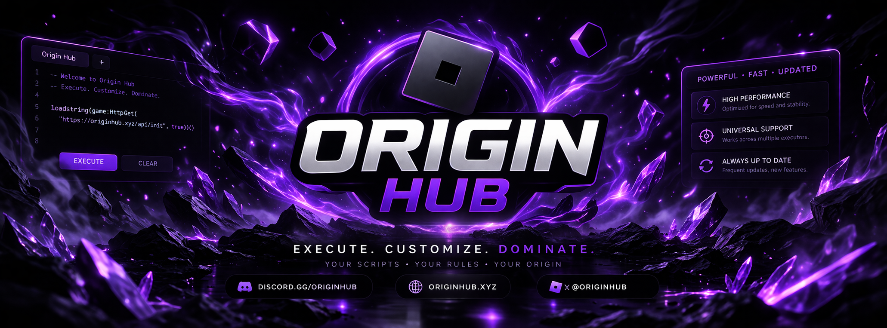
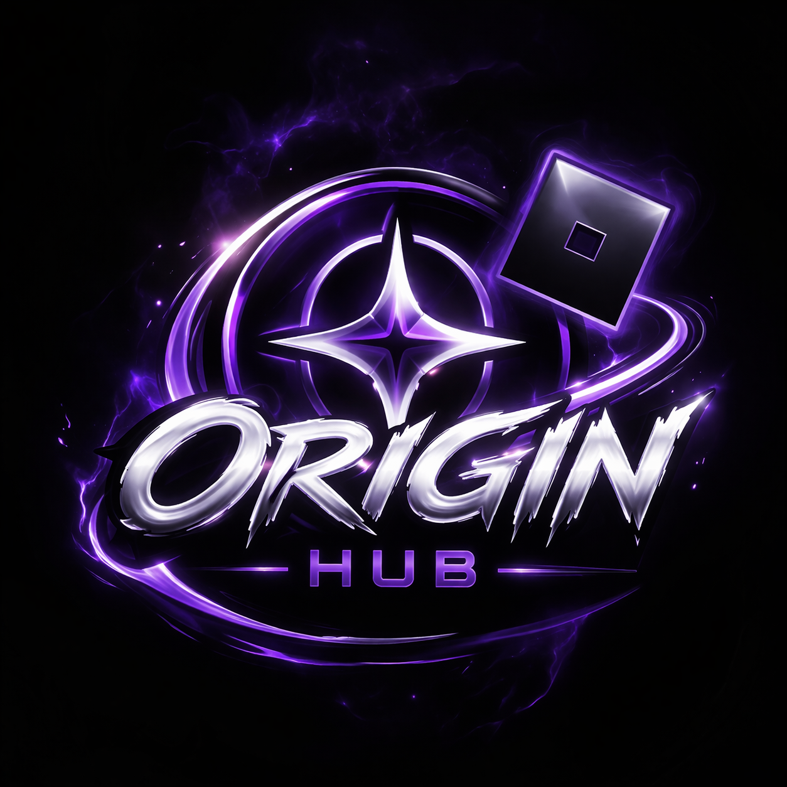

# Origin Hub

<p align="center">
  
</p>

<p align="center">
  
</p>

<p align="center">
  <strong>Powerful. Fast. Updated.</strong>
</p>

## About

Origin Hub is a Roblox script hub with a dark futuristic style, a clean identity, and a focus on performance, simplicity, and presentation.

## Features

* Fast and clean user experience
* Futuristic purple-themed branding
* Easy to expand and customize
* Designed for a polished hub presentation

## Preview

### Banner


### Logo


## Repository Structure

```text
assets/
├── originbanner.png
└── originhub.png
```

## Setup

Clone the repo:

```bash
git clone https://github.com/originhub5/originhub5.github.io.git
```

Open the project folder and edit the site as needed.

## Credits

Branding and design for **Origin Hub**.

---

<p align="center">
  <strong>Origin Hub</strong><br>
  Your scripts. Your rules. Your origin.
</p>
